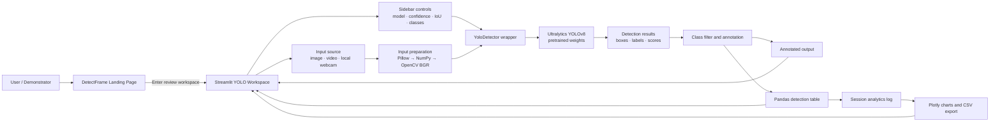
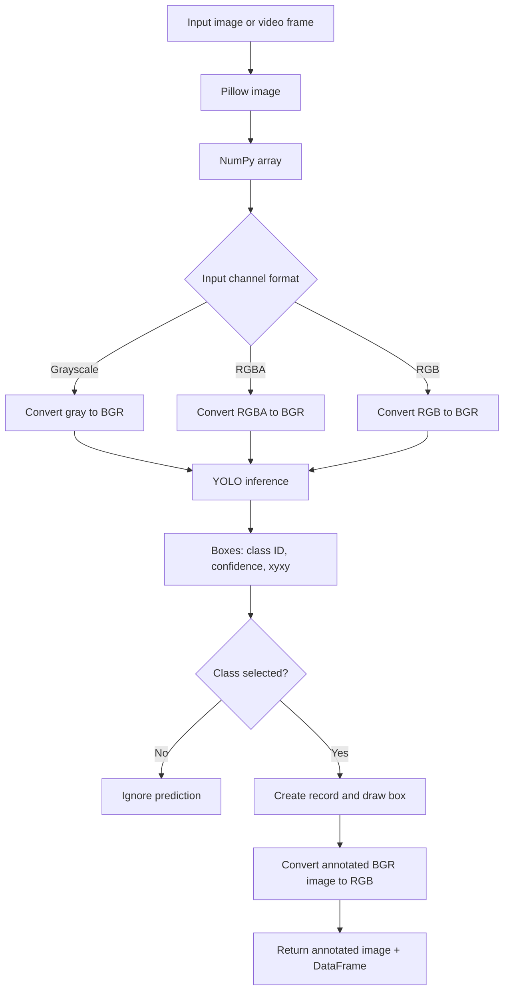
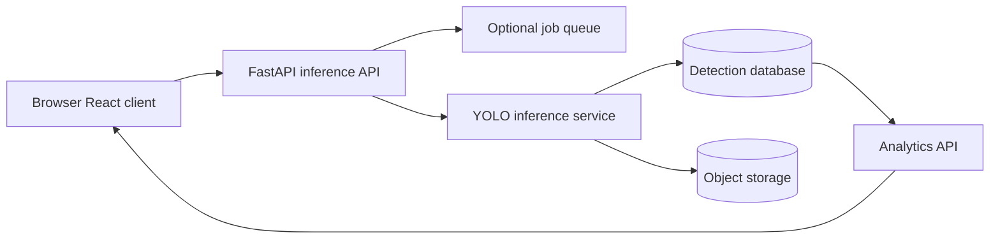

# DetectFrame / YOLO Object Detection Project

## Demonstration Documentation, Architecture, and Working-Model Summary

**Document purpose.** This guide explains how the project operates, how to demonstrate it to an evaluator, and how its user interface, YOLO inference layer, logging, and analytics fit together. The repository’s primary, working application is the root **Streamlit** application. A separate React/Vite interface is also included under `webapp/` as a design-oriented frontend, but it is not connected to the Python inference engine in the current deployment. [1] [2]

> **One-sentence project summary:** The system accepts images, videos, or a local webcam feed; applies a selected pretrained YOLOv8 detector; displays annotated bounding boxes and confidence scores; stores detection events in a session log; and turns those events into downloadable data and visual analytics.

| Item | Description |
|---|---|
| **Primary runtime** | Python + Streamlit (`app.py`) |
| **Inference engine** | Ultralytics YOLOv8, wrapped by `YoloDetector` |
| **Supported sources** | Static images, uploaded/sample videos, local webcam feed |
| **Core outputs** | Annotated frame, detection table, confidence/latency/FPS information, CSV download, Plotly analytics |
| **Model controls** | YOLOv8 Nano, Small, or Medium; confidence threshold; IoU threshold; class filtering |
| **Data persistence** | In-memory Streamlit session state during the active browser session |
| **Public entry flow** | DetectFrame landing page → explicit transition to the YOLO workspace |

---

## 1. Project Objective

The project demonstrates an end-to-end computer-vision workflow rather than only a raw model prediction. It is designed to show how a pretrained object detector can become an accessible application: the user supplies visual input, controls sensitivity and target classes, reviews annotated results, and explores the resulting detection records.

The application has four practical goals. First, it demonstrates **2D object detection** by locating objects with bounding boxes and labels. Second, it gives the operator control over the inference process through model, confidence, IoU, and class-filter settings. Third, it converts individual predictions into structured records that can be inspected or exported. Finally, it aggregates session records into visual analytics for a demonstration of data-driven decision support. [1] [3]

---

## 2. Solution Architecture

### 2.1 High-Level Architecture



The actual inference path begins in `app.py`, where Streamlit creates the user interface and retrieves control values. The selected model name is passed to `YoloDetector`, which loads the Ultralytics model and exposes a `detect` method. That method prepares the incoming image, calls YOLO, extracts boxes, filters classes, draws annotations, and returns both an annotated image and a Pandas DataFrame. [1] [2]

### 2.2 Component Responsibilities

| Component | Responsibility | Key output |
|---|---|---|
| `app.py` | Streamlit pages, controls, input handling, session logging, charts, exports | User-facing application flow |
| `detector.py` | Model caching, input conversion, YOLO inference, filtering, annotations | Annotated image + detection DataFrame |
| Ultralytics YOLOv8 | Predicts object boxes, class IDs, and confidence scores | `results[0].boxes` |
| OpenCV | Image-color conversion, video capture, drawing boxes and labels | BGR/RGB transforms and annotations |
| Pillow | Image loading and interchange between UI and detector | `PIL.Image.Image` |
| Pandas | Detection logs, statistics, CSV serialization | Tabular events and summaries |
| Plotly | Video and session analytics visualizations | Interactive charts |
| Streamlit session state | Temporary log store for the current user session | `analytics_log` DataFrame |

### 2.3 Runtime Layers

The repository currently contains two presentation layers. This distinction is important when explaining the project:

| Layer | Location | Role in the current project |
|---|---|---|
| **Production demonstration application** | Repository root (`app.py`) | Runs real YOLO inference, image/video processing, webcam capture, logging, and analytics. This is the application served by the Streamlit deployment. |
| **React/Vite frontend** | `webapp/` | A supplementary UI prototype containing a landing page and dashboard-style interactions. It is not yet wired to the Python detector API, so it should be presented as a future integration layer rather than the active inference runtime. [2] |

---

## 3. Working Model Summary

### 3.1 Model Selection

The operator chooses one of three pretrained weight files from the sidebar:

| UI option | Weight file | Demonstration trade-off |
|---|---|---|
| Nano | `yolov8n.pt` | Fastest and best for responsive demonstrations or CPU-limited systems |
| Small | `yolov8s.pt` | Balanced option for a trade-off between speed and detection quality |
| Medium | `yolov8m.pt` | Higher-capacity option, generally requiring more compute and producing slower inference |

The selected weight file is passed into the `YoloDetector` constructor. The detector calls `load_yolo_model`, decorated with `@st.cache_resource`, so a model is reused across Streamlit reruns instead of being reloaded after every interaction. [2]

### 3.2 Inference Pipeline

The model workflow is identical in principle for images, video frames, and webcam frames.



The detector accepts a Pillow image, converts it to a NumPy/OpenCV BGR representation, and passes it to the loaded YOLO model. The model call receives the selected confidence and IoU thresholds. For every returned box, the wrapper reads the class ID, class name, confidence, and `xyxy` coordinates. If class filtering is active, classes outside the selected set are ignored. Remaining predictions are added to a DataFrame and rendered as labeled rectangles on the output image. [2]

### 3.3 What Each Prediction Contains

Every accepted detection becomes one row with the fields below.

| Field | Meaning | Demonstration explanation |
|---|---|---|
| `class_name` | Predicted object category | “What the model believes it found.” |
| `confidence` | Model score for that prediction | “How strongly the model supports this detection.” |
| `x_min`, `y_min` | Top-left box coordinate | “Where the detected object begins.” |
| `x_max`, `y_max` | Bottom-right box coordinate | “Where the detected object ends.” |
| `timestamp` | Time added to the session log | “When the event was captured.” |
| `source` | Image upload, video stream, or webcam | “Which input flow produced the event.” |

### 3.4 Controls and Their Meaning

| Control | Code behavior | How to explain it during a demo |
|---|---|---|
| **Confidence threshold** | Passed to YOLO as `conf`; predictions below the selected score are suppressed | “Higher values make the detector more selective; lower values let it show more possible detections.” |
| **IoU threshold** | Passed to YOLO as `iou`, influencing overlap handling during post-processing | “This controls how aggressively overlapping candidate boxes are consolidated.” |
| **Class filter** | Applied after the detector exposes model boxes | “The user can focus the review on categories relevant to the task.” |
| **Model size** | Switches between Nano, Small, and Medium weight files | “This lets the demonstrator discuss speed-versus-capacity trade-offs.” |

> **Important demonstration note:** The current implementation uses pretrained YOLOv8 weights. It does not include a custom training pipeline, custom dataset, or fine-tuned weights in the repository. The appropriate claim is therefore “pretrained object detection with configurable inference,” not “a newly trained custom model.”

---

## 4. User-Flow Documentation

### 4.1 Landing Page to Workspace

The Streamlit application opens with the DetectFrame landing page. It provides a brief explanation of the evidence-flow concept and requires the user to select **Enter review workspace**. This action changes the session-state flag `show_workspace` and reruns the app into the full detection dashboard. The sidebar offers a reverse action, **Landing page**, to return to the opening screen. [1]

### 4.2 Static Image Detection

1. The demonstrator selects either the supplied sample image or a local JPG/JPEG/PNG file.
2. The app loads the image through Pillow.
3. The chosen detector, thresholds, and classes are applied.
4. The page shows the original image beside the YOLO-annotated result.
5. It displays detection count, latency, and mean confidence.
6. Accepted detections are appended to the session analytics log.
7. The demonstrator can inspect the DataFrame and download a CSV file. [1] [2]

### 4.3 Video Processing

1. The user selects a supplied sample video or uploads an MP4/AVI/MOV file.
2. The app uses OpenCV `VideoCapture` to read frames sequentially.
3. Each frame is converted to a Pillow image and passed through the same detector wrapper.
4. The interface updates an annotated-video placeholder and a Plotly line chart of detection count by frame.
5. The app accumulates rows into a temporary video log, then merges them into the session analytics log after processing.
6. The resulting event table can be displayed and exported as CSV. [1]

### 4.4 Live Webcam Mode

Webcam mode opens an OpenCV camera device selected by numeric index. For each captured frame, the app runs inference, displays the annotated image, computes a smoothed FPS estimate, and accumulates the detections. The camera resource is released in a `finally` block. [1]

> **Deployment limitation:** The cloud-hosted Streamlit environment does not have access to the demonstrator’s local camera through OpenCV. Webcam mode should be demonstrated on a local machine using `streamlit run app.py`; on the hosted site, use image or video mode instead. [1]

### 4.5 Session Analytics

The project initializes an `analytics_log` DataFrame in Streamlit session state. Each completed image, video, or webcam flow appends timestamped detection records. The analytics tab then derives:

| Metric or visualization | Calculation |
|---|---|
| Total logs | Number of detection rows |
| Categories | Count of unique `class_name` values |
| Mean score | Average of the `confidence` column |
| Object counts by class | `value_counts()` of `class_name` |
| Confidence distribution | Plotly box plot by class |

The log is session-scoped rather than persisted to a database. Reloading or ending a session may clear its state. [1]

---

## 5. Demonstration Script

This sequence is suitable for a five- to eight-minute final-year-project demonstration.

| Time | Demonstrator action | What to say |
|---|---|---|
| 0:00–0:45 | Show the landing page and its evidence flow | “The opening screen frames the system as human-guided review, not an uncontrolled black box.” |
| 0:45–1:30 | Enter the workspace and point to model/threshold/class controls | “The operator can choose a model capacity and control sensitivity before inference.” |
| 1:30–3:00 | Run the sample image | “The detector returns class labels, confidence, and box coordinates, then renders both the visual result and a structured table.” |
| 3:00–3:45 | Raise the confidence threshold or uncheck Select All Classes | “This demonstrates explainable operator control: we are not changing the model, but we are changing which detections the workflow accepts and shows.” |
| 3:45–5:15 | Run a short video | “The exact same detector is reused frame by frame, and the system creates a time-series count of detections.” |
| 5:15–6:00 | Open analytics | “Each mode contributes to the same session log, which produces aggregate counts, confidence distributions, and exportable records.” |
| 6:00–6:30 | State limitations and next steps | “The current system uses pretrained weights and session-scoped logging; custom training, persistent storage, and API-based frontend integration are natural next steps.” |

### Recommended Live Demo Inputs

Use a street scene or another image containing multiple common objects. This makes the effect of class filtering and confidence changes more obvious. Keep a short video prepared locally if the network connection is unreliable. For a cloud-hosted demo, avoid relying on webcam mode; explain that its OpenCV device access is a local-runtime feature.

---

## 6. Setup and Runbook

### 6.1 Local Setup

```bash
git clone https://github.com/Rachita-Basu/object-detection-with-yolo.git
cd object-detection-with-yolo

python -m venv .venv
# Windows PowerShell
.\.venv\Scripts\Activate.ps1
# macOS/Linux
# source .venv/bin/activate

pip install -r requirements.txt
streamlit run app.py
```

The application requires Python, Streamlit, Ultralytics, Pandas, OpenCV, Pillow, and Plotly. The dependency versions are declared in `requirements.txt`. [4]

### 6.2 Practical Demonstration Checklist

| Check | Why it matters |
|---|---|
| Confirm internet access once before the demo | The sample image and sample video are downloaded from remote URLs if absent locally. |
| Use Nano for a live walkthrough | It is the intended fast option and reduces the risk of slow CPU inference. |
| Start with sample image mode | It is the shortest reliable end-to-end path. |
| Clear analytics logs before a new run | Prevents previous detections from confusing the analytics narrative. |
| Use local Streamlit for webcam mode | Hosted Streamlit cannot access a local OpenCV camera device. |
| Keep a screenshot or short backup video | Protects against network, hardware, or model-download delays. |

---

## 7. Architecture Strengths and Limitations

### Strengths

| Strength | Demonstration value |
|---|---|
| Clear separation of UI and detector wrapper | Makes the system easier to explain, test, and extend. |
| Cached model resource | Avoids unnecessary model reloads during UI reruns. |
| One detector path for image, video, and webcam inputs | Shows code reuse and consistent prediction behavior. |
| Structured DataFrame output | Turns vision predictions into auditable, exportable records. |
| Configurable model and filtering controls | Lets a user demonstrate operational trade-offs. |
| Built-in analytics | Moves the project beyond a simple bounding-box demo. |

### Current Limitations

| Limitation | Consequence | Practical improvement |
|---|---|---|
| Pretrained rather than custom-trained weights | Performance depends on the pretrained label set and visual domain | Fine-tune on a labeled domain-specific dataset |
| In-memory session log | Analytics do not survive a new session | Add SQLite/PostgreSQL or object storage |
| Frame-by-frame video loop | Long videos may be slow on CPU | Add batching, frame sampling, GPU inference, or asynchronous jobs |
| Cloud webcam restriction | Browser visitor cannot use local OpenCV capture in hosted mode | Use WebRTC/browser capture or run locally |
| No authentication or role management | No user-level access control | Add authentication and protected storage |
| React frontend not connected to inference API | The design prototype cannot execute YOLO itself | Expose Python inference through FastAPI/REST and connect the frontend |

---

## 8. Suggested Future Architecture

For a production-grade evolution, retain the detector wrapper but move inference behind an API boundary.



This separation would allow the React interface to submit an image or video, receive structured predictions, retain a history of analyses, and serve multiple users. It also isolates resource-intensive inference from presentation concerns.

---

## 9. Questions an Evaluator May Ask

| Question | Suggested answer |
|---|---|
| “Is this model trained by you?” | “The current repository uses pretrained YOLOv8 weights. My contribution is the application workflow: configurable inference, visual review, structured logs, analytics, exports, and interface design. A custom-training extension is outlined as future work.” |
| “What is confidence threshold?” | “It is the minimum model score accepted for display. Raising it reduces low-confidence detections; lowering it shows more candidates.” |
| “What does IoU control?” | “It controls how overlapping candidate boxes are handled during inference post-processing, helping limit duplicate boxes around the same object.” |
| “Why use Pandas?” | “It gives each detection a clean tabular representation, which makes statistics, charts, CSV export, and future database storage straightforward.” |
| “Why is webcam local only?” | “The current implementation uses OpenCV camera-device access. A cloud server cannot see a visitor’s local hardware. Local Streamlit runs can access the device; a future browser/WebRTC design would solve this for hosted use.” |
| “How could this be improved?” | “Custom-trained weights, persistent logs, user authentication, API-based inference, asynchronous video processing, and a connected React frontend.” |

---

## References

[1]: https://github.com/Rachita-Basu/object-detection-with-yolo/blob/main/app.py "Streamlit application flow, inputs, logging, and analytics"

[2]: https://github.com/Rachita-Basu/object-detection-with-yolo/blob/main/detector.py "YOLO detector wrapper and annotation workflow"

[3]: https://github.com/Rachita-Basu/object-detection-with-yolo/blob/main/README.md "Repository overview and supported features"

[4]: https://github.com/Rachita-Basu/object-detection-with-yolo/blob/main/requirements.txt "Declared Python runtime dependencies"

[5]: https://github.com/Rachita-Basu/object-detection-with-yolo/blob/main/webapp/README.md "Secondary React/Vite frontend documentation"
